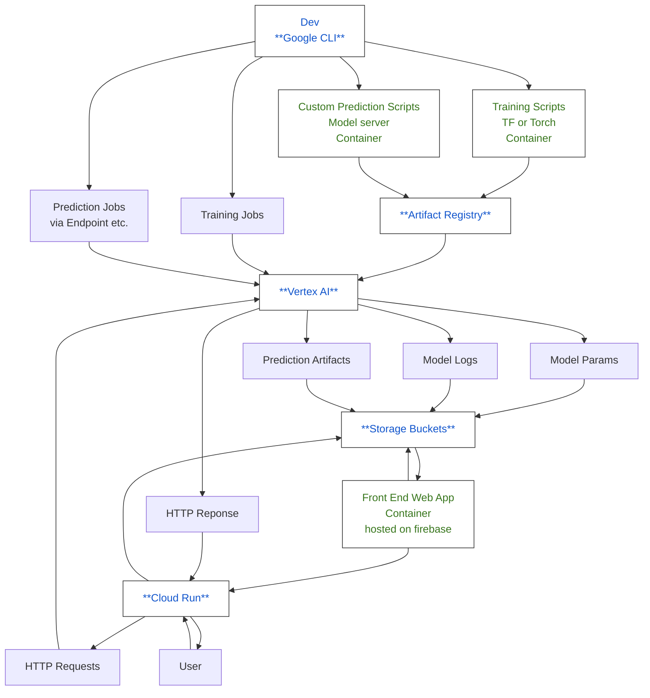

# Repository map
This gives a description of the directories for each part of the project. 

## TODO 
0. Make a mermaid diagram for the demo flow and tool set
1. Make more web apps   
    * UI/UX  host on github pages
    *  should be able to do static only with animations + project descriptions
2. Use Wikipedia REST API to get pages. 
    * Need to make a parser to get Word freqeuncy lists + dictionary pages from Wiktionary 
    *  wikipedia has the REST API, Witkionary returns HTML pages. 
3. Create a heirarchical text dataset from task 2. 
4. Train a text classifier for the heirarchical relationships
5. Make a text embedding + look up table. 
    * No need for the final layer of a word model to have N words output shape. 
    * consider binary,or an embedding structure to have less outputs but still represent all words. 

## Search Bar
Search bar feature comes up in basically every application. for the book data analysis I figured I'd make a script to parse the text files into an sql data base with time stamps and key word matches -- WordCheck.py. Then the TextServer.py serves the UI (main.html+style.css+script.js) as well as parses requests to the sql database. The server responds with every entry in the database that has that particular key word... I need to make a vector out of the key words or something, then add those hash values to the sqlite data base so I can search up hash values. 

but no really, Google + Ask Jeeves, Bing --> the UI is a search bar right in the middle of the page + a bunch of nlp + page rank and search algos in the background... open all the apps on your phone -- youll find search bars in like 90% of them. Every phone app is basically a nice HTTP request front end. The magic comes from how you do some of the user usage prediction to know when to store things on the device or when to get new information from the server via request. 

Check out NanoChat, their UI is like this too. --> https://github.com/karpathy/nanochat

## RAGTextAppParts
Making the parts for a text application that uses Retrieval Augmented Generation. Focusing in on the retreival part, and data object generation for now. 

### Scripts
Introduced a new folder called SandBox, to keep some legacy scripts that aren't a part of the main demo. Main demo scripts currently include

1. AC_pythonexample.py 
    * implements a Trie  to do pattern matching from a user defined list of inputs. Could do this with regex, but that would require multiple passes over the text. Trie's can scan for multiple words (and patterns) in a single pass over the text. Implements the aho-corasick algorithm. 
    * Need to expand the TrieNode and Trie class to handle a full char set instead of just the 26 lowercase english alphabet though. Also may move from class to dictionary structure - memory difference. Includes a function to get word pairs from the word list by using numpy mesh grid. Otherwise we would have to use a nested for loop 
    * numpy is c implemented so this should be faster than a raw pyhton implementation (need to time though). Pair finder function just looks for the 2 key words within an n-long window of sentences. Dumps JSON files for individual words, and pair words including character index within the main text, and windowed text samples.  

2. Graph_making2.py 
    * uses the word pair json file and pyvis to create a graph that shows the relationships between all characters defined by the user. Nodes are characters, edges represent the numebr of times those 2 characters occured together within the n-sentence window. 

3. UI_0.py 
    * Graphic User Interface to wrap up funcitonality from the 2 above scripts. It does also draw the GetSentences() function from sandbox/TapeReader.py. will modify so everyhting is in this top folder. 
    
    * GUI needs some work so that the tabs arent as cluttered, and theres less buttons. BUT, right now it is geared so that the user can work through the demo from left to right, so keep on that. need to add 3rd tab to show JSON output.. it's long though. 4th tab would show the graph. and maybe a 5th would have connection to a Hugging face model like gemma-250 or gpt2 (see sandbox scripts with HF suffix for simple implementation.)

4. hf_embed_classify.py
    * Uses hugging face DistilBertTokenizer, DistilBertModel to classify text

---
Sandbox/
1. Aho_Corasick.cpp 
    * C++ implementation of aho_corasick trie algorithm. current timing isn't much faster than the python implementation. There's some optimization that is needed to get better performance here, but in the demo the timing isn't so bad that it's worth it to dig deeper here for now. (200ms range). 
2. demo.py 
    *  first pass at a PyQt GUI for this project. too much is going on in 1 pannel. decided to add tabs page + signals to pass data between pages. 

3. FeatureCrafting.py 
    *  implements functions to extract paragraphs, sentences, quoted text, words, single characters (special, vs alpha num). Primarily uses Regular expressions to do this. When calling in the main code there's multiple passes over the text    
    *  my initial thought was to make a state machine that is checking for all sorts of patterns. Aho-Corasick already does that nicely. Extracting sentences and paragraphs like this enables computation of words/paragraph, and words/sentence -> quantifiable descriptors of writing style. 
    *  Detection of double capitalized words is good for finding proper nouns. Need to improve this to use at the front of AC_pythonExample.py, so that the user doesn't have to define their word list, or so we have a nice way of extracting key words and phrases without a priori knowledge. Find what matters using an unsupervised learning approach - something the user might not have thought of but is still an important pattern.  

4. TapeReader.py 
    *  Secondary pass that uses regex patterns to pull paragraphs, sentences, gets nouns, but has some hard filtereing steps to reduce the number of word pairs used for the graph construction. Checks for the occurence of word pairs in windows of words (n sentences). Currently gets end count of word pairs 
    *  going to expand to get indices of increment for the word pairs 
    *  then save the whole thing to a JSON. So you have word1, word2, list of indices. 
    *  from there we can do text classifiers to look for more interesting relationships. 

5. Graph_making.py 
    *  use pyvis to make an html graph of the csv file dumped from TapeReader.py.

6. kivy_text_annotator.py 
    *  User Interface based in kivy. Quickest way to prototype functions without making a full blown app

7. SimpleTextGen_HF.py 
    *  simple demo for getting LLM outputs from a local model 
    *  need to tack this on to the end of AC_PythonExample.py 
    *  extracted sentences can be used as payloads to provide context for querries submitted to LLM + RAG approach.

8. ParagraphFiltAndSummary_HF.py 
    *  designing a prompt for summarizing text, more RAG approach. 

### Other Notes
*Text features and knowldege graph construction*

Need to look into neo4j *  graph RAG tool for AI models. So this tool is inspired by that and this YouTube video https://www.youtube.com/watch?v=j2T4gvQAiaE&t=567s where the creator uses a graph based approach to studying friendships between characters in top mangas. Find words (people, proteins, genes) that occur in the same episode (window of text). This is relavent for LLMs because as users pass inputs to the model their context windows fill up. Graph based approaches are just one class that can be used to create data structures that might reduce the amount of information you need to pass to the context window to get good results. *  SO I figure I need to build some text processing tools that are not totally AI. Maybe part of the context over load leads to positive reinforcement cycles that are bad for people's health. 

Existing tools : neo4j, Letta, Anthropic Claude Memory management.  
https://www.letta.com/

*Hugging face models and usage* 
This stuff 
hugging face model card will have everything that the model is used for, how it was trained, etc. 
For example https://huggingface.co/FacebookAI/roberta-large-mnli
this one is a text classificaiton model *  built on BERT *  bidirectional encoder representations from transformers
Multi-genre Natural language inference (MNLI)
Trained on masked language modeling objective. 

## System Design note for cloud 
Here's a graph showing all the parts that you would want to build out for a AI/ML web application. Might improve this later, or add a simpler graph for a local app or something. 
### Full AI Service Loop on GCP

## GoogleColabs
1. CardiacSignalsStuff.ipynb
    * This example uses the MIT-BIH arrhymia data set (copy on physionet) which contains ECG signals from multiple views along with data like patient age, sex, and medication lists. The data was taken in the 80s and digitized. In this example we load some of the data with the wfdb library, show the frequency spectrum and filter the signal. I also wrote a simple algorithm to extract the R-R intervals. I generate prompts given the patient meta data and the R-R intervals, and pass those prompts to gpt2 using the huggingface hosted gpt2 model. There's some interesting results here. The model definitely needs some finetuning, but it is a cool way to test out something of a full pipeline that involves: signal loading, cleaning, windowing, phyisological feature extraction, followed by prompting for text generation. The options here would be to fine tune gpt2 or to put some more work into the SimpleTextGen_tensorflow.py model. But for now this is enough. 

2. Designing Text Retrieval Functions.ipynb 
    *  this uses regular expresions to get paragraphs, sentences, and quotes from the text. Then looks for double caps words to and has a filter right after to get first name + last names of some characters. Theres a section on building pairs and finding those pairs within sentence windows. Plots a directed word graph, the sentence number that word pairs occur within the text, and a plot on the introduction of new words in general.  

3. Building Knowledge Graphs.ipynb - consider ommitting this. 

4. Experimenting with Hugging Face.ipynb 
    *first pass at parsing text with hugging face models. 

## TransformerTurorials
1. AndrejKarpathy_SimpleTextGen_pytorch.py
uses a bigram model trained on cross entropy to do text generation. Follow along with this tutorial 
https://www.youtube.com/watch?v=kCc8FmEb1nY&t=776s *  Will end up showing you how to do the full transformer in pytorch. current progress on this is at the bigram model

2. SimpleTexGen_tensorflow.py
uses a transformer model implemented in tensorflow to do the same text generation.
transformer_parts.py *  has the custom tensorflow layres for the Simple_TextGen_tensorflow.py example. Model implments the transformer but could use some polishing on the loss funciton. 

## ImageParts
Need to make a GUI for this one too. I have some plant images and that public x-ray data set that I want to experiment with. 
1. patchmaker.py *  use this to extract patches from the main image that we can train on 
2. local_tf_ResNetTuner.py
