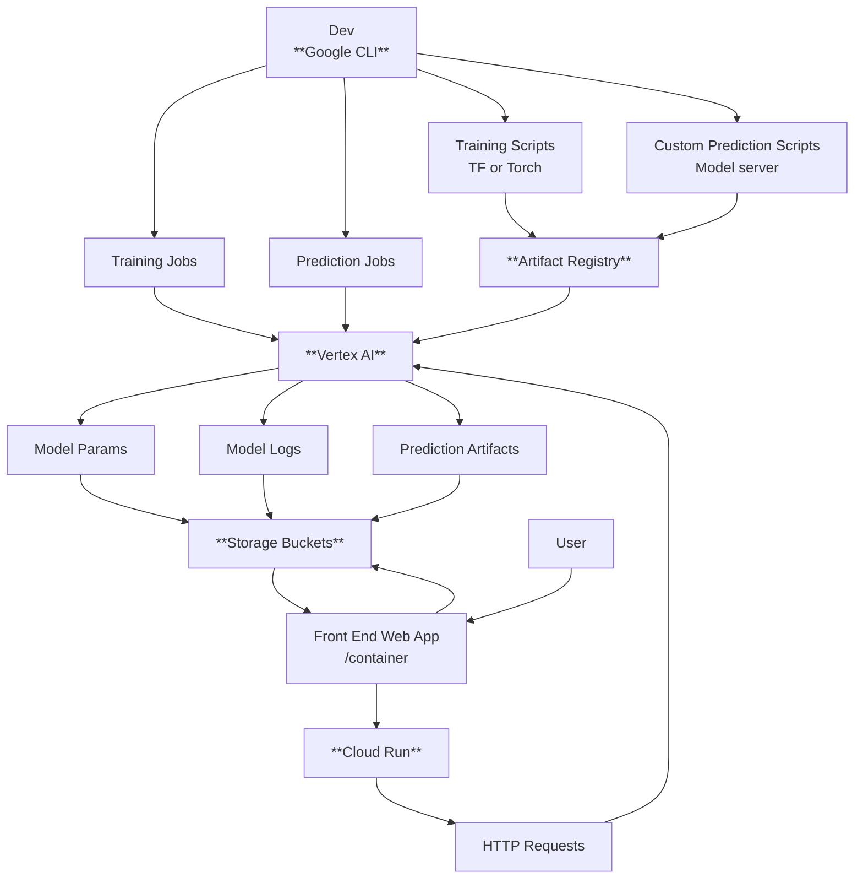

# Repository map
This gives a description of the directories for each part of the project. 

## TODO 
1. Continue experimenting with web apps --UI/UX
2. Use Wikipedia API to get a list of common words, a dictionary, and some articles 
3. Create a heirarchical text dataset from task 2. 
4. Train a text classifier for the heirarchical relationships
5. Make a text embedding + look up table. No need for the final layer of a word model to have N words output shape. consider binary,or an embedding structure to have less outputs but still represent all words. 

## RAGTextApp
Making the parts for a text application that uses Retrieval Augmented Generation. Focusing in on the retreival part, and data object generation part though. 

### Scripts
1. FeatureCrafting.py -- initial pass at extracting nouns, sentences, words, etc. 
2. TapeReader.py -- Secondary pass that uses regex patterns to pull paragraphs, sentences, gets nouns, but has some hard filtereing steps to reduce the number of word pairs used for the graph construction. Checks for the occurence of word pairs in windows of words (n sentences). Currently gets end count of word pairs -- going to expand to get indices of increment for the word pairs -- then save the whole thing to a JSON. So you have word1, word2, list of indices. --> from there we can do text classifiers to look for more interesting relationships. 
3. Graph_making.py -- use pyvis to make an html graph of the csv file dumped from TapeReader.py.
4. kivy_text_annotator.py -- User Interface based in kivy. Quickest way to prototype functions without making a full blown app
5. local_text.py -- simple demo for getting LLM outputs from a local model. 
6. paragraph_filter_and_summary.py -- designing a prompt for summarizing text

### Other Notes
*Text features and knowldege graph construction*

Need to look into neo4j -- graph RAG tool for AI models. So this tool is inspired by that and this YouTube video https://www.youtube.com/watch?v=j2T4gvQAiaE&t=567s where the creator uses a graph based approach to studying friendships between characters in top mangas. Find words (people, proteins, genes) that occur in the same episode (window of text). This is relavent for LLMs because as users pass inputs to the model their context windows fill up. Graph based approaches are just one class that can be used to create data structures that might reduce the amount of information you need to pass to the context window to get good results. -- SO I figure I need to build some text processing tools that are not totally AI. Maybe part of the context over load leads to positive reinforcement cycles that are bad for people's health. 

Existing tools : neo4j, Letta, Anthropic Claude Memory management.  
https://www.letta.com/

*Hugging face models and usage* 
This stuff 
hugging face model card will have everything that the model is used for, how it was trained, etc. 
For example https://huggingface.co/FacebookAI/roberta-large-mnli
this one is a text classificaiton model -- built on BERT -- bidirectional encoder representations from transformers
Multi-genre Natural language inference (MNLI)
Trained on masked language modeling objective. 

## System Design note for cloud 
# Full AI Service Loop on GCP

## GoogleColabs
1. CardiacSignalsStuff.ipynb
This example uses the MIT-BIH arrhymia data set (copy on physionet) which contains ECG signals from multiple views along with data like patient age, sex, and medication lists. The data was taken in the 80s and digitized. In this example we load some of the data with the wfdb library, show the frequency spectrum and filter the signal. I also wrote a simple algorithm to extract the R-R intervals. I generate prompts given the patient meta data and the R-R intervals, and pass those prompts to gpt2 using the huggingface hosted gpt2 model. There's some interesting results here. The model definitely needs some finetuning, but it is a cool way to test out something of a full pipeline that involves: signal loading, cleaning, windowing, phyisological feature extraction, followed by prompting for text generation. The options here would be to fine tune gpt2 or to put some more work into the SimpleTextGen_tensorflow.py model. But for now this is enough. 

2. Designing Text Retrieval Functions.ipynb -- this uses regular expresions to get paragraphs, sentences, and quotes from the text. Then looks for double caps words to and has a filter right after to get first name + last names of some characters. Theres a section on building pairs and finding those pairs within sentence windows. Plots a directed word graph, the sentence number that word pairs occur within the text, and a plot on the introduction of new words in general.  

3. Building Knowledge Graphs.ipynb - consider ommitting this. 

4. Experimenting with Hugging Face.ipynb -- first pass at parsing text with hugging face models. 

## TransformerTurorials
1. AndrejKarpathy_SimpleTextGen_pytorch.py
uses a bigram model trained on cross entropy to do text generation. Follow along with this tutorial 
https://www.youtube.com/watch?v=kCc8FmEb1nY&t=776s -- Will end up showing you how to do the full transformer in pytorch. current progress on this is at the bigram model

2. SimpleTexGen_tensorflow.py
uses a transformer model implemented in tensorflow to do the same text generation.
transformer_parts.py -- has the custom tensorflow layres for the Simple_TextGen_tensorflow.py example. Model implments the transformer but could use some polishing on the loss funciton. 

## ImageParts
Need to make a GUI for this one too. I have some plant images and that public x-ray data set that I want to experiment with. 
1. patchmaker.py -- use this to extract patches from the main image that we can train on 
2. local_tf_ResNetTuner.py
